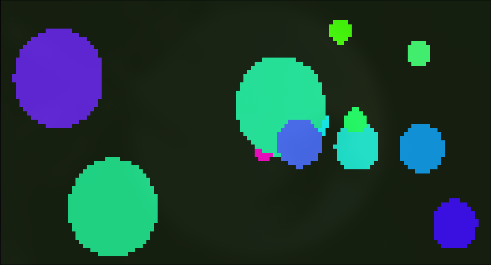

# Ball Engine - Terminal Bouncing & Splitting



Um motor de física de partículas de alto desempenho que roda diretamente no terminal Linux, inspirado pelo projeto **LAVAT**. Utiliza truques de renderização ANSI para obter resoluções de sub-caracteres e cores vibrantes.

## 🚀 Funcionalidades

- **Renderização de Sub-caractere**: Utiliza o caractere de meio bloco (`▀`) para dobrar a resolução vertical do terminal.
- **Cores Dinâmicas**: Ciclos de cores baseados em HSV usando sequências de escape TrueColor (24-bit).
- **Física de Partículas**:
    - Detecção de colisão com as bordas do terminal.
    - **Fusão**: Duas bolas do mesmo tamanho se atraem magneticamente e se fundem em uma maior.
    - **Divisão**: Bolas grandes explodem em várias pequenas ao colidir com as paredes.
- **Responsivo**: Ajusta automaticamente a simulação ao redimensionar a janela do terminal.
- **Eficiente**: Escrito em C++17 puro, sem dependências externas como ncurses ou APIs gráficas.

## 🐧 Compatibilidade

Este projeto foi desenvolvido exclusivamente para sistemas **Linux** devido ao uso de `ioctl` para controle de terminal e sequências de escape ANSI específicas.

## 🛠️ Como Compilar e Rodar

Certifique-se de ter o `g++` instalado.

```bash
g++ -O2 -std=c++17 -o ball_engine main/ball_engine.cpp
./ball_engine
```

## 🎮 Controles

- **Ctrl+C**: Sai da simulação e restaura as configurações originais do terminal.
- **Redimensionamento**: O motor detecta o sinal `SIGWINCH` e adapta a renderização instantaneamente.

## 💡 Inspiração

Inspirado pelo efeito visual de lâmpadas de lava e pelo projeto [LAVAT](https://github.com/angelofallars/lavat).
